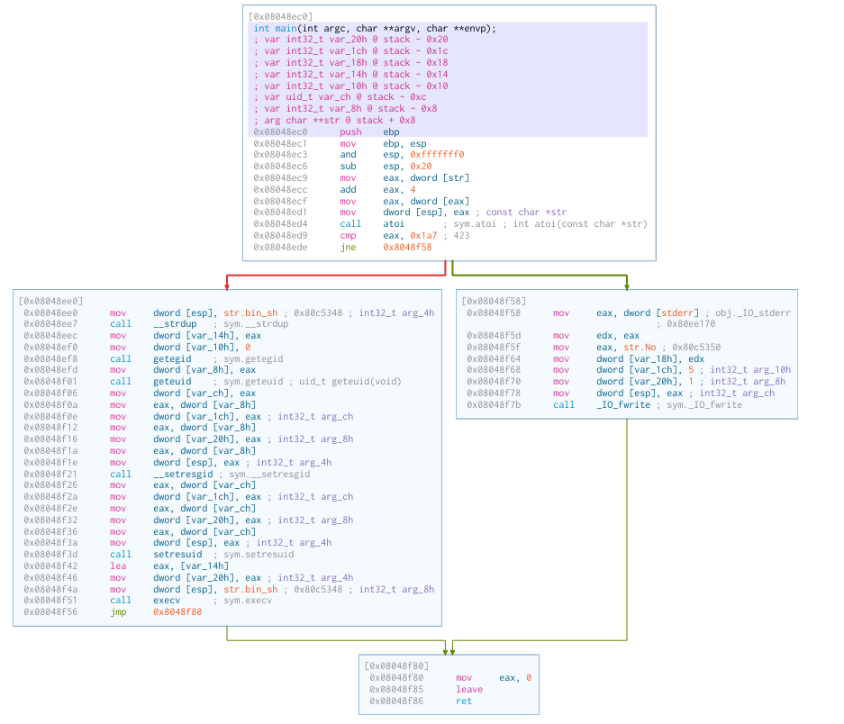

# Level 0

## First clue
- once logged in as level0 a simple `ls -la`reveals the existence of a `level0` file, owned by `level1`:
```
level0@RainFall:~$ ls -la
total 737
dr-xr-x---+ 1 level0 level0     60 Mar  6  2016 .
dr-x--x--x  1 root   root      340 Sep 23  2015 ..
-rw-r--r--  1 level0 level0    220 Apr  3  2012 .bash_logout
-rw-r--r--  1 level0 level0   3530 Sep 23  2015 .bashrc
-rwsr-x---+ 1 level1 users  747441 Mar  6  2016 level0
-rw-r--r--  1 level0 level0    675 Apr  3  2012 .profile
```
- if we inspect `level0` we find out that it is an executable:
```
file level0
level0: setuid ELF 32-bit LSB executable, Intel 80386, version 1 (GNU/Linux), statically linked, for GNU/Linux 2.6.24, BuildID[sha1]=0x85cf4024dbe79c7ccf4f30e7c601a356ce04f412, not stripped
```
- we try to execute it without arguments and we get a segfault
- we try with difernet arguments, either alphabetical or numerical and sometimes we get a "no!" as return, sometimes siyntax error etcetera
- so we understand that we have to find the right argument

## Inspect with gdb
- we go with Gnu Debugger `gdb`: `gdb ./level0`
- we try to run the program : `(gdp) run`
- we want to inspect whet the main function in the executable does with `(gdb) disassemble main` and 3 lines of the output have all our attention:
```
   0x08048ed4 <+20>:	call   0x8049710 <atoi>
   0x08048ed9 <+25>:	cmp    $0x1a7,%eax
   0x08048ede <+30>:	jne    0x8048f58 <main+152>
```
- what these three lines do:
    - Call to atoi:
    0x08048ed4 <+20>: call 0x8049710 <atoi>
    This line calls the atoi function, which converts a string to an integer.
    The value returned by atoi is stored in the %eax register.
    - Comparison (cmp):
    0x08048ed9 <+25>: cmp $0x1a7,%eax
    This line compares the value stored in the %eax register with the hexadecimal value 0x1a7 (equivalent to decimal 423).
    - Conditional Jump (jne):
    0x08048ede <+30>: jne 0x8048f58 <main+152>
    This line is a conditional jump instruction.
    If the comparison result of the previous cmp instruction is not equal (jne stands for "jump if not equal"), the program will jump to the memory address 0x8048f58, which corresponds to a location further in the main function.

- ok so if we pass "423" as argument of the executable `level0`maybe something happens

### Manipulation of Group and User IDs:
- `strdup`: The program then calls strdup, which duplicates the string pointed to by 0x80c5348 (likely a string representation of a file path or command).
- `getegid`: The effective group ID (egid) of the process is obtained using getegid and stored at 0x1c(%esp).
- `geteuid`: The effective user ID (euid) of the process is obtained using geteuid and stored at 0x18(%esp).
- `setresgid`: The setresgid function is called to set the real (ruid), effective (euid), and saved (suid) group IDs of the process. The values passed are taken from 0x1c(%esp).
- `setresuid`: The setresuid function is called to set the real (ruid), effective (euid), and saved (suid) user IDs of the process. The values passed are taken from 0x18(%esp).
### Preparation for execv:

The address of the argument string (duplicated using strdup) is placed at 0x10(%esp).
0x0 is placed at 0x14(%esp), which may represent the end of the argument array for execv.
The execv system call is then invoked with the argument array.

## Solution
- actually by providing the specific input 423, we successfully triggered the vulnerability, allowing the program to spawn a shell prompt ($). This shell prompt provided us with control over the program's execution.

- Interacting with the Shell:
With the shell prompt available, I was able to interact with the program, explore the environment, discover with `whoami` that I am `level1` and so I can finally print the content of the .pass file that is our goal as specified in the project description:
```
 cat /home/user/level1/.pass
1fe8a524fa4bec01ca4ea2a869af2a02260d4a7d5fe7e7c24d8617e6dca12d3a
```
- using the flag as password for `su level1` allow us to access the next level `level1`

## Cutter output
